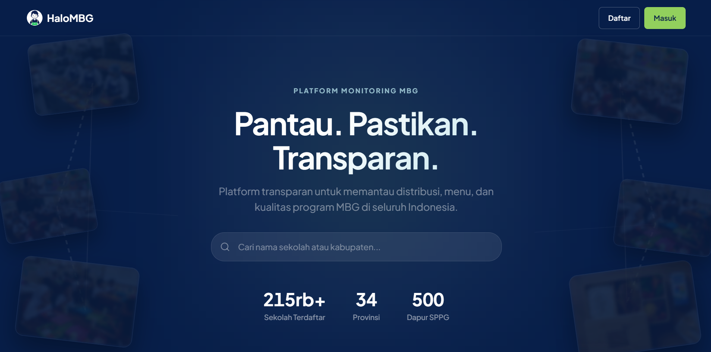
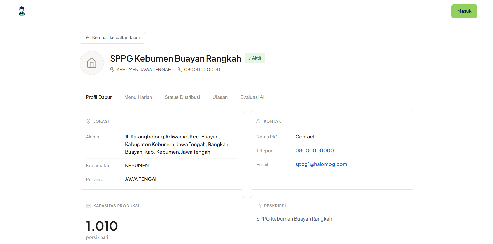
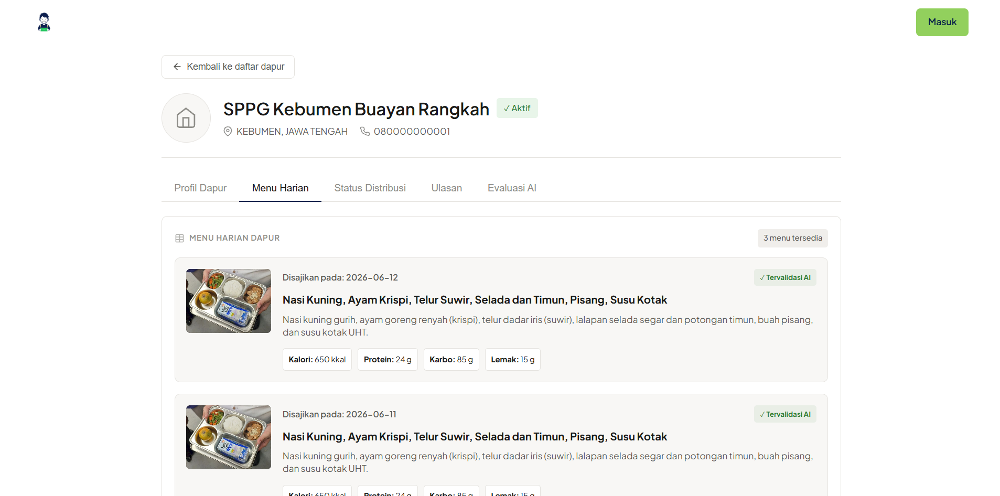
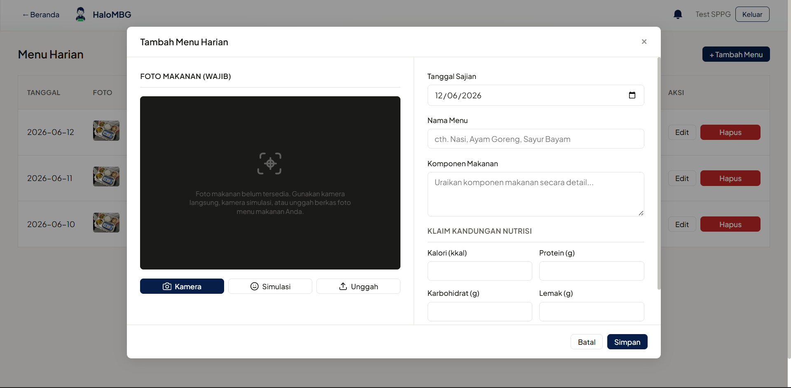
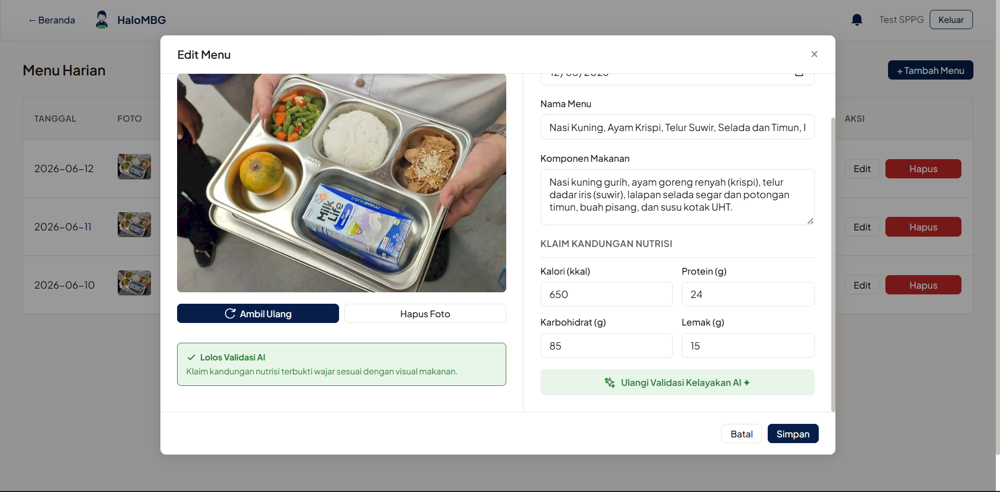
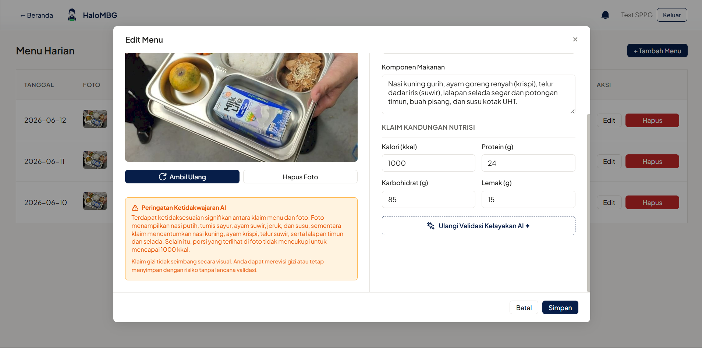
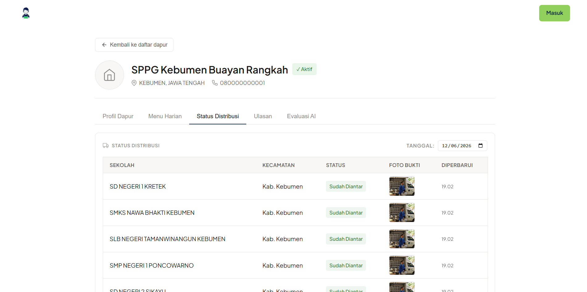
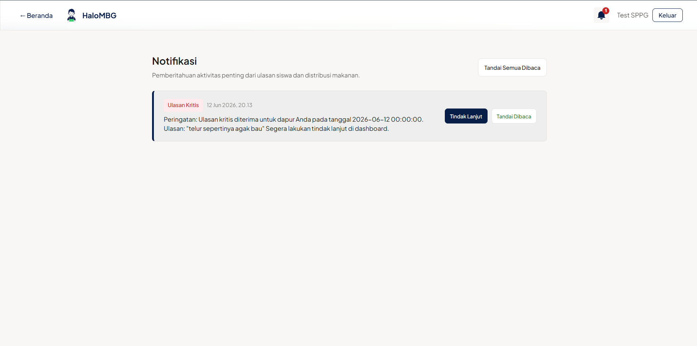
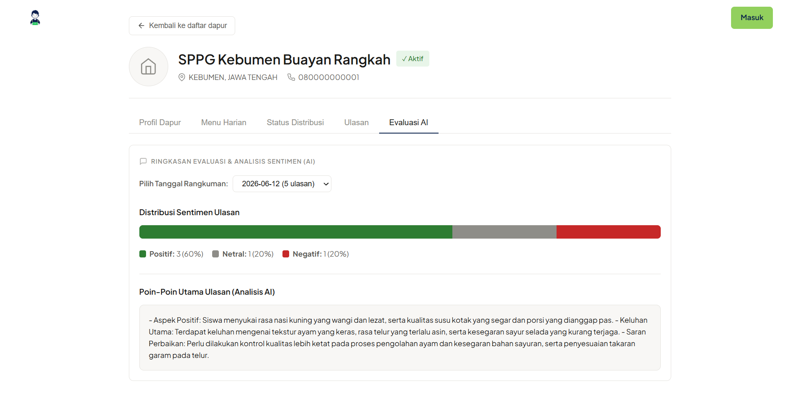

# HaloMBG

Aplikasi Monitoring Program Makan Bergizi Gratis (MBG) untuk memantau distribusi makanan, menu harian, dan kualitas gizi sekolah.

HaloMBG hadir sebagai solusi monitoring berbasis web yang mengintegrasikan transparansi data, validasi nutrisi berbasis kecerdasan buatan (AI) melalui analisis foto dan teks, serta partisipasi aktif komunitas. Platform ini bertujuan untuk memastikan program MBG berjalan sesuai standar, meningkatkan akuntabilitas, dan memberikan akses informasi yang terbuka bagi publik, termasuk siswa, orang tua, guru, dan masyarakat umum.

---

## Tim Pengembang (CEO MBG)

| Nama Lengkap | NIM | Peran (Minggu 1-3) | Peran (Minggu 3-6) | Peran (Minggu 6-9) | Peran (Minggu 9-12) |
|---|---|---|---|---|---|
| Firizqi Aditya Mulya | L0124016 | Project Manager | QA/Docs | Developer 2 | Developer 1 |
| Fairuz Shiba Alkhirza | L0124014 | Developer 1 | Project Manager | QA/Docs | Developer 2 |
| Yashif Victoriawan | L0124124 | Developer 2 | Developer 1 | Project Manager | QA/Docs |
| Nurman Aqil Wicaksono | L0124139 | QA/Docs | Developer 2 | Developer 1 | Project Manager |

---

## Fitur Utama Aplikasi

HaloMBG dilengkapi dengan berbagai fitur fungsional untuk mendukung pengawasan akuntabel program makan gratis:

1. **Sistem Autentikasi Multi-Role & Google SSO (BL-01):** Otentikasi terpisah untuk Admin, Operator Dapur (SPPG), Guru, dan Siswa. Pendaftaran Guru tervalidasi menggunakan nomor induk NIP Dapodik, pendaftaran Siswa menggunakan NISN Dapodik, serta integrasi Google OAuth (Socialite) untuk kemudahan masuk.
2. **Profil Dapur SPPG & Pemetaan Sekolah (BL-02):** Halaman profil publik dapur SPPG yang menampilkan kapasitas produksi, lokasi, data kontak, serta daftar sekolah terlayani di wilayah kecamatan bersangkutan.
3. **Pencarian Sekolah & Dapur (BL-03):** Fitur pencarian sekolah dan dapur SPPG terdekat berbasis nama sekolah atau nama kecamatan secara dinamis.
4. **Form Input Menu & Kandungan Gizi (BL-04):** Antarmuka bagi operator dapur untuk memasukkan menu makanan harian lengkap dengan komponen bahan makanan dan takaran gizi makro (Energi/Kalori, Protein, Karbohidrat, Lemak).
5. **Validasi Gizi Berbasis AI Vision (BL-05):** Integrasi backend dengan model `gemini-flash-lite-latest` untuk memverifikasi secara visual foto makanan nyata yang diambil langsung melalui WebRTC kamera (frontend) dengan klaim kandungan gizi yang diinput oleh operator SPPG.
6. **Master Data & Admin Panel (BL-06):** Dashboard administrator untuk mengelola data master sekolah, profil dapur SPPG baru, serta memetakan batas wilayah operasional distribusi.
7. **Pelacakan Status Distribusi Harian (BL-07):** Monitoring waktu pengiriman makanan dari dapur ke sekolah secara real-time, lengkap dengan kewajiban unggah foto bukti serah terima di sekolah tujuan.
8. **Notifikasi WhatsApp Keterlambatan Pengiriman (BL-08):** Peringatan otomatis melalui integrasi WhatsApp Gateway ke pihak sekolah dan admin jika waktu pengantaran makanan melewati batas toleransi keterlambatan (pukul 12.00 siang).
9. **Sistem Ulasan & Rating Siswa (BL-09):** Wadah umpan balik langsung bagi siswa untuk memberikan rating (bintang 1-5), ulasan teks, serta foto bukti porsi makan siang yang diterima.
10. **Moderasi Ulasan oleh Guru (BL-10):** Halaman filter/moderasi bagi Guru sekolah terkait untuk memastikan ulasan siswa yang ditampilkan di portal publik bebas dari unsur spam/tidak sopan.
11. **Push Notifications & Alert Lonceng (BL-11):** Sistem notifikasi in-app untuk mengabarkan status pembaharuan menu, status pengantaran, dan alert ulasan kepada Guru/Admin.
12. **WhatsApp Alert untuk Ulasan Kritis (BL-12):** Notifikasi WhatsApp instan ke ponsel pengelola dapur (SPPG) jika sistem mendeteksi siswa memberikan rating buruk atau menulis kata kunci keluhan kritis (basi, busuk, berulat, beracun).
13. **Analisis Sentimen & Rangkuman Evaluasi AI (BL-13):** Halaman evaluasi dapur publik yang menyajikan grafik kepuasan visual dan rangkuman evaluasi ulasan harian siswa secara otomatis oleh AI Gemini.

---

## Arsitektur & Tech Stack

Aplikasi HaloMBG dibangun menggunakan arsitektur *fully decoupled* (sisi client dan server terpisah utuh) dengan susunan teknologi berikut:

* **Frontend (Client-Side):**
  * **ReactJS (v18)** sebagai pustaka antarmuka berbasis komponen.
  * **Vite** sebagai build tool dan server pengembangan.
  * **Tailwind CSS** untuk implementasi *Design System* (`DESIGN.md`) yang responsif dan konsisten.
  * **Framer Motion** untuk memperhalus transisi halaman dan mikro-animasi antarmuka.
  * **Axios** sebagai HTTP client untuk komunikasi API.
  * **WebRTC API** untuk akses kamera dan konversi jepretan foto secara lokal.
* **Backend (Server-Side):**
  * **Laravel 13 (PHP 8.3)** sebagai core framework API.
  * **Laravel Sanctum** untuk otentikasi API berbasis token SPA yang aman.
  * **Laravel Socialite** untuk integrasi Google SSO OAuth2.
  * **Dedoc Scramble** untuk pembuatan dokumentasi API Swagger/OpenAPI otomatis dan interaktif.
* **Database & Storage:**
  * **PostgreSQL 15** sebagai database relasional utama.
  * **Docker Volumes** untuk penyimpanan file persisten database dan aset media.
* **AI & API Eksternal:**
  * **Google Gemini API** (Model `gemini-flash-lite-latest`) untuk analisis AI Vision (foto makanan) dan analisis sentimen teks (ulasan siswa).
  * **Fonnte API Gateway** untuk pengiriman notifikasi otomatis langsung ke nomor WhatsApp pengelola dapur (SPPG).

---

## Panduan Instalasi dan Menjalankan Aplikasi

Aplikasi HaloMBG dikemas menggunakan Docker Compose untuk memudahkan instalasi dan memastikan konsistensi lingkungan pengembangan di backend, frontend, database, dan web server.

### Prasyarat
Sebelum memulai, pastikan perangkat Anda telah terpasang:
1. **Docker Desktop** (untuk Windows/macOS) atau **Docker Engine** (untuk Linux).
2. **WSL 2** (Windows Subsystem for Linux) jika Anda menggunakan sistem operasi Windows.

### Langkah-Langkah Menjalankan Aplikasi

1. Buka terminal (atau WSL terminal jika di Windows) dan masuk ke direktori `framework` proyek ini:
   ```bash
   cd framework
   ```
2. Buat file konfigurasi lingkungan `.env` dengan menyalin contoh yang ada:
   * **Untuk folder root `framework/`:**
     ```bash
     cp .env.example .env
     ```
   * **Untuk folder backend `framework/backend/`:**
     ```bash
     cp backend/.env.example backend/.env
     ```
   * **Untuk folder frontend `framework/frontend/`:**
     ```bash
     cp frontend/.env.example frontend/.env
     ```

3. **Konfigurasi API Keys (Penting):**
   Buka file `framework/backend/.env` yang baru dibuat dan isi variabel berikut jika ingin menguji fitur AI dan WhatsApp:
   ```env
   # API Key Google Gemini
   GEMINI_API_KEY=your_gemini_api_key_here

   # Token WhatsApp Fonnte
   WHATSAPP_ENABLED=true
   WHATSAPP_FONNTE_TOKEN=your_fonnte_token_here
   ```

4. Jalankan container Docker:
   - Untuk **pertama kali** atau jika ada perubahan file konfigurasi:
     ```bash
     docker compose up --build -d
     ```
   - Untuk **menjalankan normal** (sudah pernah build):
     ```bash
     docker compose up -d
     ```
5. Lakukan instalasi database dan data seeders awal (opsional jika database masih kosong):
   ```bash
   docker compose exec backend php artisan migrate:fresh --seed
   ```
6. Akses layanan aplikasi melalui web browser:
   - **Frontend (ReactJS + Vite):** [http://localhost:5173](http://localhost:5173)
   - **Backend API (Laravel):** [http://localhost:80](http://localhost:80)
   - **API Documentation (Dedoc Scramble):** [http://localhost:80/docs/api](http://localhost:80/docs/api)
   - **Database PostgreSQL:** `localhost:5433` (kredensial sesuai file `framework/.env`)

### Akun Uji Coba Demo
Gunakan akun bawaan sistem berikut untuk mencoba alur aplikasi:
* **Operator Dapur (SPPG):** `sppg@halombg.com` dengan password `password` (melayani SD Negeri 1 Bocor).
* **Administrator:** `admin@halombg.com` dengan password `password`.
* **Siswa & Guru:** Anda dapat mendaftarkan akun baru secara langsung di halaman registrasi.
  - Pendaftaran Siswa memerlukan NISN valid simulasi Dapodik (contoh: `0080000102` untuk siswa bernama Budi Santoso di SD Negeri 1 Bocor).
  - Pendaftaran Guru memerlukan NIP (contoh: `198710102010121002`) dan menghubungkannya dengan SD Negeri 1 Bocor.

---

## Screenshot Aplikasi

Berikut adalah beberapa tampilan utama dari aplikasi HaloMBG:

### 1. Portal Publik (Landing Page) & Pencarian
Halaman utama yang dapat diakses oleh masyarakat umum untuk mencari sekolah dan melihat profil dapur SPPG penyedia makanan.


### 2. Detail Profil Dapur SPPG
Halaman detail profil dapur SPPG lengkap dengan deskripsi, info kontak, daftar sekolah terlayani, menu, dan status distribusi harian.


### 3. Tampilan Menu Harian
Detail menu makanan bergizi harian lengkap dengan foto makanan riil dan takaran gizi makro.


### 4. Formulir Input Menu Harian oleh SPPG
Formulir bagi operator dapur untuk menginput komponen menu harian, data gizi makro, serta kewajiban mengunggah foto makanan riil.


### 5. Validasi Nutrisi AI - Lolos Validasi
Tampilan pop-up status validasi AI Gemini Vision yang memberikan lampu hijau (nutrisi wajar/tervalidasi) berdasarkan analisis visual foto porsi makanan.


### 6. Validasi Nutrisi AI - Peringatan Ketidakwajaran
Tampilan pop-up ketika sistem AI Gemini Vision mendeteksi adanya ketidaksesuaian yang signifikan antara visual porsi makanan dengan klaim data gizi yang diinput.


### 7. Status Distribusi Makanan & Bukti Pengiriman
Tampilan monitoring status pengiriman makanan dari dapur ke sekolah tujuan secara real-time lengkap dengan kewajiban upload bukti foto serah terima.


### 8. Penanganan Ulasan Kritis oleh Dapur
Panel dashboard SPPG untuk menindaklanjuti ulasan dari siswa yang mengandung kata kunci keluhan kritis (basi, bau, dll.).


### 9. Ringkasan Evaluasi & Analisis Sentimen AI
Grafik kepuasan serta ringkasan ulasan harian siswa yang diekstrak dan dirangkum secara otomatis oleh AI untuk ditampilkan ke publik.
