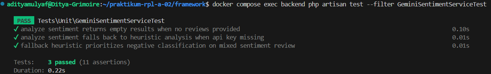
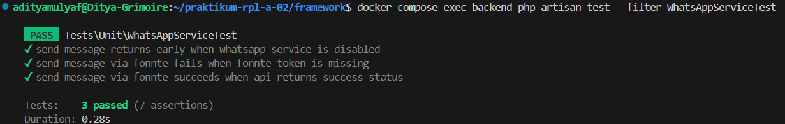
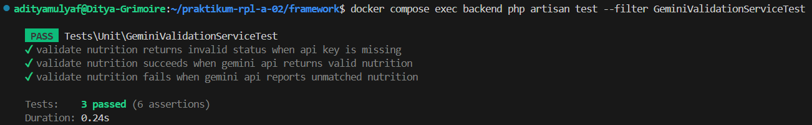
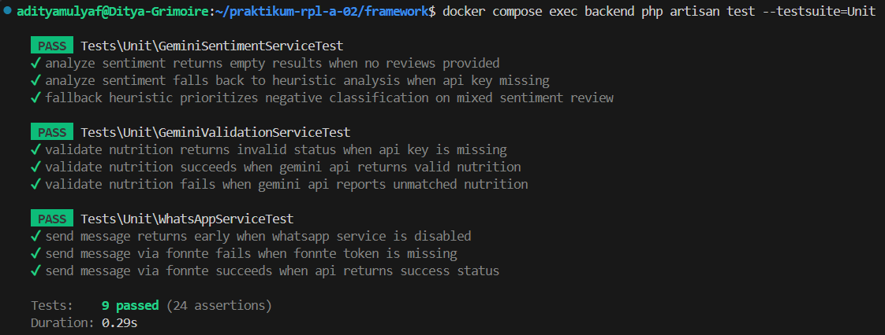
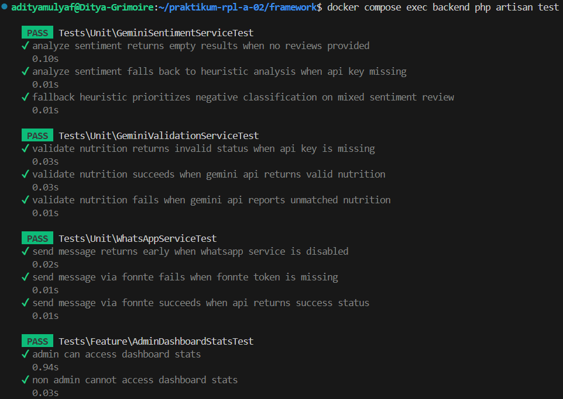
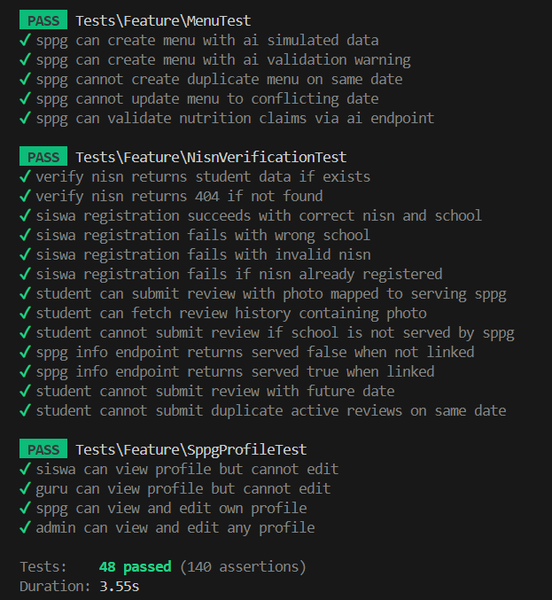

# Log Hasil Pengujian Unit Testing

Berikut adalah dokumentasi eksekusi unit test di dalam container backend Laravel.

## 1. Eksekusi Per Unit Test (Individual)

### A. Gemini Sentiment Service Test
#### Command yang Dijalankan:
```bash
docker compose exec backend php artisan test --filter GeminiSentimentServiceTest
```
#### Bukti Eksekusi (Screenshot):


---

### B. WhatsApp Service Test
#### Command yang Dijalankan:
```bash
docker compose exec backend php artisan test --filter WhatsAppServiceTest
```
#### Bukti Eksekusi (Screenshot):


---

### C. Gemini Validation Service Test
#### Command yang Dijalankan:
```bash
docker compose exec backend php artisan test --filter GeminiValidationServiceTest
```
#### Bukti Eksekusi (Screenshot):


---

## 2. Eksekusi Unit Test Suite (9 Test)

### Command yang Dijalankan:
```bash
docker compose exec backend php artisan test --testsuite=Unit
```

### Bukti Eksekusi (Screenshot):


---

## 3. Eksekusi Seluruh Test (Unit + Feature - 48 Test)

### Command yang Dijalankan:
```bash
docker compose exec backend php artisan test
```

### Bukti Eksekusi (Screenshot):


